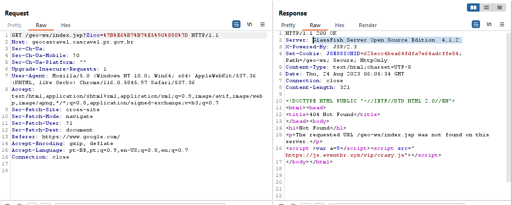

[Documentation](https://linktodocumentation)  
<!DOCTYPE html>
<html>

<head>
  <title>Análise de Código Malicioso</title>
</head>

<body>

<h1>Detecção e Análise de Código Malicioso em dominios gov.br ou edu.br</h1>

Este documento descreve a análise de um código malicioso encontrado em um site. O código em questão realiza várias ações suspeitas, como manipulação de URLs, redirecionamentos e ocultação de elementos.

<h2>Visão Geral do Código</h2>

O código é uma combinação de JavaScript e código obfuscado que executa várias ações em um determinado alvo.

<h3>Script de Rastreamento de Análise</h3>

Os primeiros scripts no código são para serviços de rastreamento, como Baidu Analytics e Google Analytics, para acompanhar as interações dos usuários no site.

<h3>Decodificação de Dados</h3>

O código contém uma função personalizada para decodificar dados obfuscados, usando decodificação base64 com operações adicionais.

<h3>Manipulação de URLs</h3>

O código manipula URLs usando a função de decodificação e atribui as URLs decodificadas de volta às variáveis.

<h3>Análise de Cliente e Referenciador</h3>

O código verifica o domínio de referência do usuário e compara com informações na matriz customerx.

<h3>Detecção de Dispositivo Móvel</h3>

Uma função tenta detectar se o usuário está em um dispositivo móvel com base no agente do usuário.

<h3>Redirecionamento de URL e Injeção de Iframe</h3>

Com base na análise anterior, o código redireciona o usuário para diferentes URLs ou injeta um iframe.

<h3>Manipulação do DOM e Ocultação</h3>

O código tenta manipular o DOM e ocultar elementos na página.

<h3>Comportamento Malicioso ou Suspeito</h3>

A obfuscação do código e suas ações suspeitas indicam comportamento malicioso.

<h2>Detalhes Adicionais</h2>

O código inclui uma requisição feita pelo Burp Suite, retornando um código 200 para um título "404".

Um link no código aponta para um script em um domínio suspeito.

<h2>Exemplos de Código</h2>

<h3>Integração de Rastreamento e Análise</h3>
<pre>
<code>
<h1> BUSCA NO BURP SUITE DE ALGUNS ALVOS</h1>

Claramente, consegui acha algumas formas que esses 167 sites governamentais e educacional sofreram esse ataque, porem não vou divulgar nesse documento, não vai ser apresentado as tecnicas. 

Aqui esta a requesição que fiz pelo burp suite

Obeserve o titulo *404*, porem a solicitação retorno 200, dentro do corpo da resposta tem cereja do bolo que é script 

link acesso o codigo https://js.eventbr.xyz/vip/crazy.js

vamos tentar obeter algumas informação para entender melhor
alguns exemplos para onde estamos sendo direcionados. 

url_pc_jpx="YUhSMGNITTZMeTkzZDNjdWQycGlaWFF1WTJ4MVlpOXBibVJsZUQ5aFptWnBiR2xoZEdWRGIyUmxQWFpwY0RnNE9BPT0=";

Observe pela imagem que ele foi criptografado em base64, 2 vez para tentar ofuscar. 

](image/image-1.png)

</code>
</pre>

<h3>Manipulação de URLs e Redirecionamento</h3>
<pre>
<code>
url_pc_jpx = "https://www.wjbet.club/index?affiliateCode=vip888";
url_m_jpx = "https://www.wjbet.club/index?affiliateCode=vip888";
url_pc_jpx = mydecx(mydecx(url_pc_jpx));
url_m_jpx = mydecx(mydecx(url_m_jpx));

url_pc_frmex = "https://www.wjbet.club/index?affiliateCode=vip888";
url_m_frmex = "https://www.wjbet.club/index?affiliateCode=vip888";
url_pc_frmex = mydecx(mydecx(url_pc_frmex));
url_m_frmex = mydecx(mydecx(url_m_frmex));
</code>
</pre>

<h3>Screenshot</h3>

Observe o endereço de ip

<h2>Conclusão</h2>

O código analisado exibe características típicas de comportamento malicioso, como obfuscação e manipulação de URLs. A análise detalhada fornece insights sobre as ações executadas pelo código.
Para quem quiser colaborar com a pesquisa esta aberto para todos.
Tive que ocultar muitas informação, não sou bom em documentação mais utilizei forma mais simples de tentar explicar para todos. 

</body>

</html>

## Authors  
- [@jacksonzacarias](https://www.github.com/jacksonzacarias)  
